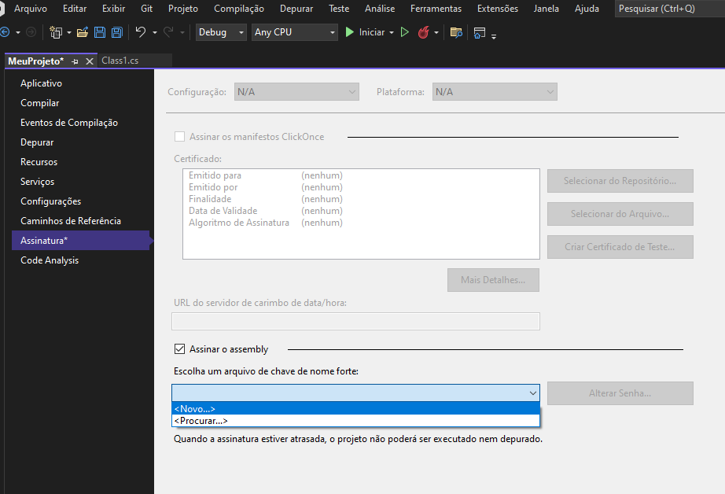

# Plugins

## Treinamento Desbravando Plugins

<iframe src="https://salestalentbr.sharepoint.com/sites/TreinamentosBizapp/_layouts/15/embed.aspx?UniqueId=2e2ff6b0-9e49-5455-e034-eb9cfb8d7a3a&embed=%7B%22ust%22%3Atrue%2C%22hv%22%3A%22CopyEmbedCode%22%7D&referrer=StreamWebApp&referrerScenario=EmbedDialog.Create" width="853" height="480" frameborder="0" scrolling="no" allowfullscreen title="[Bizapp] Treinamento Desbravando Plug-ins (hands-on)-20220902_034553.mp4"></iframe>

## Criando o primeiro plugin

Siga o passo a passo abaixo para criar o primeiro plug-in


**Abra o visual studio e crie um projeto do tipo Biblioteca de Classes .Net framework**


**Adicione um nome ao seu projeto, uma pasta e selecione a versão 4.6.2**


**Ao criar o projeto, você terá um resultado igual a imagem abaixo**


**Clique com o botão direito do mouse no projeto e vá em Gerenciar Pacotes do Nuget. Vamos instalar a biblioteca do SDK**


**Em Procurar, pesquise pela biblioteca Microsoft.CrmSdk.CoreAssemblies e instale**


**Agora clique com o botão direito do projeto e vá em Propriedades -> Assinatura > Novo**

>Nosso projeto precisa que o assembly tenha um nome forte. Clique [aqui](https://www.devmedia.com.br/utilizando-assinaturas-de-nome-forte/3600) para saber mais sobre assinaturas



**Dê um nome para chave e clique em OK**


**Agora seu projeto terá um arquivo .snk**


**Agora renomeie sua classe e vamos começar a codar. Adicione ": IPlugin" após o nome da classe**

>Vamos começar implementando a interface IPlugin do SDK. O Visual studio apresentará uma mensagem de erro informando que IPlugin não pode ser encontrado. Isso porque só instalamos a biblioteca SDK no nosso projeto e precisamos dar um using na nossa classe.

**Pressione o botões "Ctrl + ponto" para abrir as sugestões do visual studio. Selecione a opção using Microsoft.Xrm.Sdk** 


**Novamente o visual studio apontara um erro. Pressione o botões "Ctrl + ponto" e pedira para implementar a interface**
>Interface  nada mais é que um contrato. Se você diz que sua classe implementa um interface, TODOS os métodos dessa interface deverão ser implementados.


**Pressione F12 no IPlugin e visualize os membros da interface**
>Temos um método de nome Execute, que retorna void e e um parametro de IServiceProvider. Toda classe que implementar a interface IPlugin, terá um método com essa assinatura


**Até o momento nosso plug-in está assim**
Dentro desse método **Execute** adicionaremos a nossa lógica de negócios.


**Antes de adicionar a nossa lógica vamos precisar do ServiceFactory, Context, Service e TrackingService**
ServiceFactory: interface que usamos para criar uma instância da service
Service: interface que executa as operações de associate, disassociate, execute, create, update, delete, retrieve e retrieve multiple no dataverse
Context: informações dos dados da entidade, do pipeline de execução, do ambiente, do plugin, etc.
TrackingService: interface que nos permite criar logs


Vamos nos concentrar no context, service e trackingService primeiro.

Como eu crio um log?
É simples. Tendo em mãos a interface do ITracingService basta utilizar o metodo Trace, igual o exemplo abaixo:

```
var trackingService = (ITracingService)serviceProvider.GetService(typeof(ITracingService));
trackingService.Trace("Aqui vai os dados do seu log");
```

**Sobre o context... vamos ver quais são as informações dentro dele. Veja abaixo:**


**Calma que ainda tem mais um pouco**


A partir do Context conseguimos acessar diversas informações sendo elas:
- Qual o é ambiente Dynamics
- Quem foi o usuário que acionou o plug-in
- Qual entidade se refere
- Qual é o estágio(step) do plug-in **pre-validation=10, pre-operation=20 e post-operation=40**
- Qual é o evento que acionou o plug-in

Imagine um plug-in para validar o CNPJ de uma empresa.
Então o usuário preencherá os dados da conta e ao salvar os nosso plug-in rodará.
Para verificar se o CNPJ da conta é válido ou não, precisaremos acessar os campos que preenchidos pelo usuário.

Como faremos isso? Acessando o **InputParameters**.
Veja que dentro do InputParameters há uma coleção de dados com apenas uma linha. A chave é **Target** e o valor é um Microsoft.Xrm.Sdk.**Entity**.


Para acessar os dados preenchidos vamos usar o código abaixo:
`var tabelaEmpresa = (Entity)Context.InputParameters["Target"];`


**E a partir daí já podemos acessar os campos da entidade passados via Context**.


**E o que seria uma Entity? É uma Classe do SDK que representa a nossa tabela.** 
Ela possui atributos e métodos. Veja abaixo:


Se eu quiser buscar o valor de algum campo, basta usar o método **GetAttributeValue<TipoDoCampo>(NomeLogicoDoCampo)**


```
var minhaEmpresa = (Entity)context.InputParameters["Target"];
var cnpj = minhaEmpresa.GetAttributeValue<string>("bz_cnpj");
```

**E como usamos a service? Basicamente ela executa comandos dentro da base de dados do Dynamics**
Abaixo um exemplo de como criar um contato via plugin


```
var contato = new Entity("contact");
contato["firstname"] = "Guilherme";
contato["lasatname"] = "Campos";
contato["nickname"] = "Loki";
service.Create(contato);
```
Criamos um objeto do tipo Entity dizendo que seria do tipo contato e preenchemos os campos de nome, sobrenome e apelido.
O comando service.Create(contato); é o que cria o registro no Dataverse.
 


**Agora que já sabemos um pouco mais sobre os recursos, vamos seguir desenvolvendo o nosso primeiro plugin.**
Até o momento temos o seguinte código

            //ServiceFactory: interface que usamos para criar uma instância da service    
            var serviceFactory = (IOrganizationServiceFactory)serviceProvider.GetService(typeof(IOrganizationServiceFactory));

            //Context: contem as informações dos dados da entidade, do pipeline de execução, do ambiente, do plugin, etc.
            var context = (IPluginExecutionContext)serviceProvider.GetService(typeof(IPluginExecutionContext));

            //Service: interface que executa as operações de associate, disassociate,
            //execute, create, update, delete, retrieve e retrieve multiple no dataverse
            var service = serviceFactory.CreateOrganizationService(context.UserId);

            //TrackingService interface que nos permite criar logs
            var trackingService = (ITracingService)serviceProvider.GetService(typeof(ITracingService));   

Vamos fazer um plug-in crie uma tarefa vinculado a um contato para que o vendedor entre em contato em até 2 dias.

            
```
var contato = (Entity)context.InputParameters["Target"];
            var tarefa = new Entity("task");
            tarefa["subject"] = $"Ligue para o {contato.GetAttributeValue<string>("firstname")}";
            tarefa["description"] = "Dê as boas vindas";
            tarefa["scheduledend"] = DateTime.UtcNow.AddDays(2);
            tarefa["regardingobjectid"] = contato.ToEntityReference();
            service.Create(tarefa);
```

**Salve o compile seu projeto.** 
O visual studio irá gerar a dll do nosso plugin que utilizaremos para subir no dataverse


**Clique com o botão direito no projeto e abra pasta no gerenciador de arquivos.**
Irá abrir a pasta onde está nosso projeto


**Vá na pasta Bin > Debug > e você encontrará o arquivo .dll com o nome do seu projeto**
