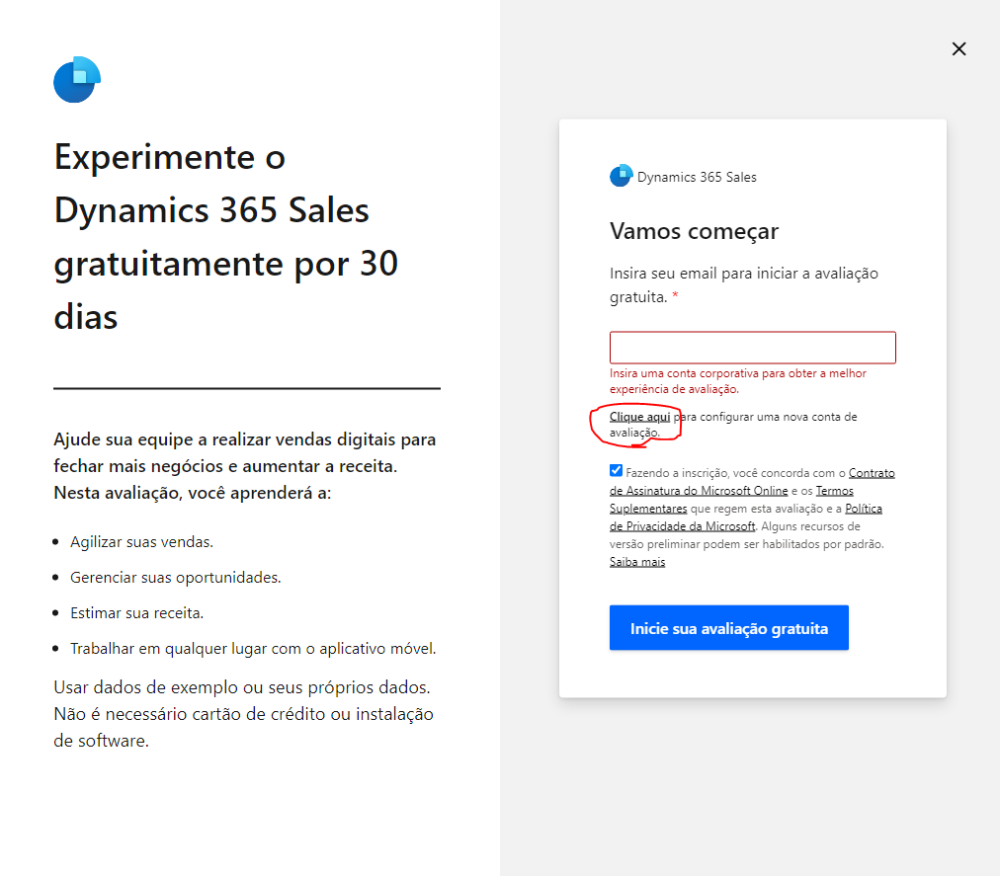

# Criando um trial

**Há duas formas de solicitar um trial, através do Microsoft Customer Digital Experiences e pela forma convencional**

## Microsoft Customer Digital Experiences (CDX)

>Para criar um trial pelo CDX [clique aqui](https://cdx.transform.microsoft.com/my-tenants)

**Certifique-se de estar logado na conta da Biz. Clique em Create Tenant**

**Escolha o periodo de 90 dias de duração e localização deixa em North America**

**Escolha Dynamics 365 Customer Engagement**

**Aceite os termos de uso**

**Você será direcionado para os dados de acesso do seu novo ambiente**

## Convencional

>Para criar um trial, [clique aqui](https://dynamics.microsoft.com/en-us/dynamics-365-free-trial/)

**O site da Microsoft abrirá então clique em Experimente de graça**

**Clique no check para concordar com o Contrato de Assinatura > Inicie sua avaliação gratuita > Clique Aqui**
Não preencha o campo e-mail nesse momento. Uma mensagem de erro irá aparecer e o botão **Clique aqui** estará disponível 

**Adicione um e-mail que NÃO seja da Bizapp > Próximo -> Configurar Conta**

**Preencha os dados > Próximo**

**Faça a verificação**

**Defina usuário, nome do domínio e senha > Próximo**

**Confirme algumas informações > Salvar**

**Na última etapa pede um CNPJ. Preencha o valor e pronto.**

